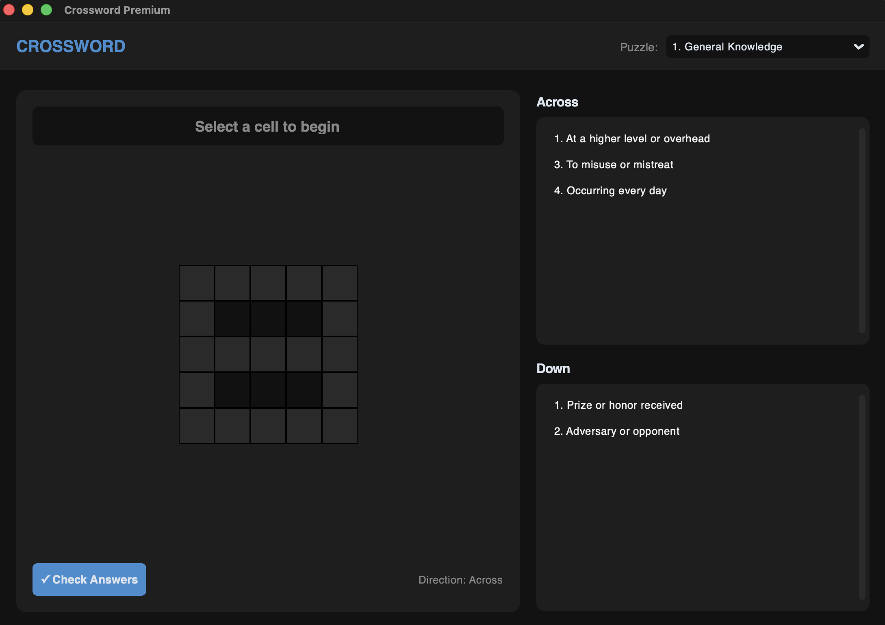
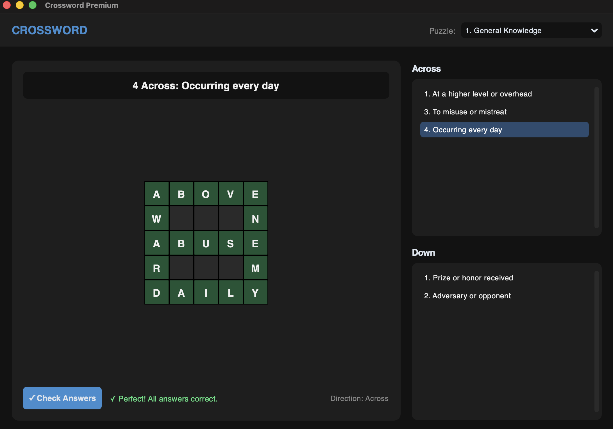

# 🧩 Crossword Game

**Crossword** is the experience you may have been waiting for!

Tired of boring, clunky crossword interfaces? We get it. It's a sleek, modern, and high-performance desktop game built with Python and `CustomTkinter`. It's got a dark-mode-first design, smooth keyboard navigation, and it's fast—just like the engine powering it.

---

## ⚡ Powered by Speed

Life is too short for slow package managers. That's why **Crossword** uses [uv](https://astral.sh/uv/) for lightning-fast dependency management.

---

## ✨ Why You'll Love It

* **Modern Aesthetic:** Dark mode looks sharp. The UI is clean, professional, and easy on the eyes.
* **Pro-Level Controls:** Navigate with arrow keys, hit `Backspace` to correct mistakes, and tap `Escape` to toggle between "Across" and "Down" in a flash.
* **Instant Gratification:** Get real-time color-coded feedback on your answers. No more guessing if you're right!
* **Modular Magic:** The code is split up (logic, UI, settings, puzzles, main), making it super easy to add your own themes or levels.

---

## 🛠️ Get Up and Running (in seconds!)

First, make sure you have [uv](https://docs.astral.sh/uv/getting-started/installation/) installed. Once you have it, setting up the game is a breeze:

- **Clone the repo** (or download the files) and jump into the project folder.

- **Sync the project** (this handles everything):

   ```bash
   uv sync
   ```

- **Game on!** Run the game instantly:

   ```bash
   uv run main.py
   ```

* *(That's it. You're ready to start solving.)*

---

## 🎮 How to Play

* **Click or Tab** to select your cell.
* **Type** to fill in the grid.
* **Escape** toggles your direction (Across/Down).
* **Check Answers** when you're feeling confident (or just desperate!).

---

## 📸 Screenshots of the Crossword Game

* Screenshot of the start of the game



* Screenshot of a completed game



---

## 🤝 Contributing

Want to help make Crossword even better? You're in the right place.

Whether you're adding puzzle packs, fixing bugs, or proposing new features — we welcome it. Check out our full [Contributing Guide](CONTRIBUTING.md) for setup steps, coding standards, and the PR process.

**Quick start:** `uv sync && uv run pytest` — if all tests pass, you're ready to go.

---

## 📄 License

This project is licensed under the MIT License - see the [LICENSE](LICENSE) file for details.
